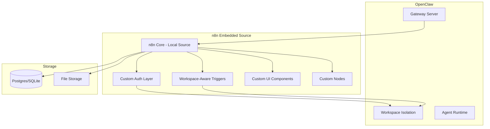
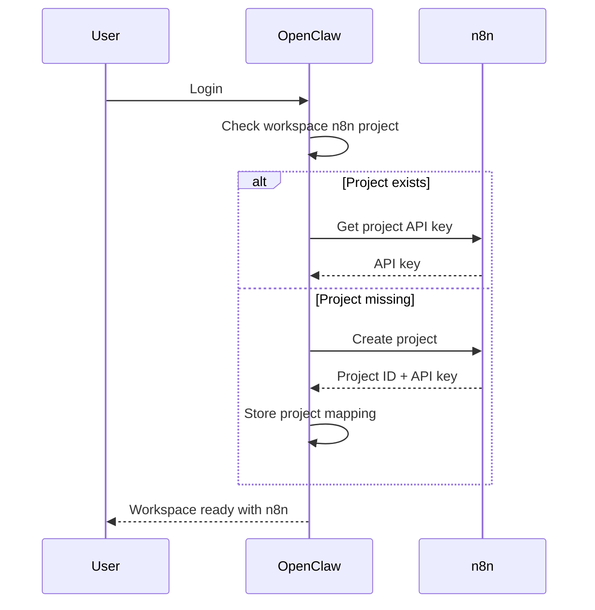
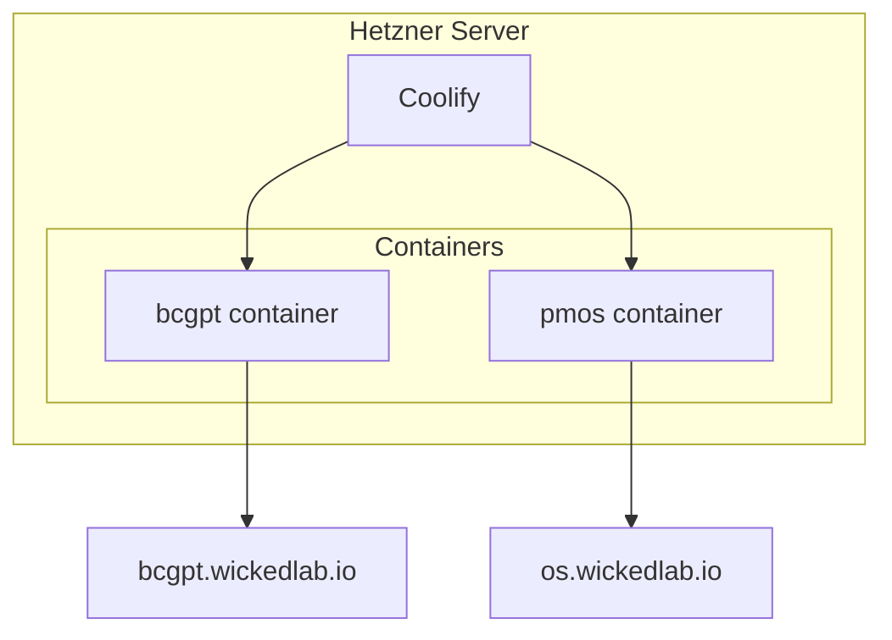

# n8n Integration Guide

**Last Updated:** 2026-02-18
**Related:** [`OPENCLAW_AUTOMATION_OS.md`](OPENCLAW_AUTOMATION_OS.md), [`COOLIFY_DEPLOY_NX_RUNBOOK.md`](COOLIFY_DEPLOY_NX_RUNBOOK.md)

---

## Overview

OpenClaw uses n8n as its workflow automation engine, replacing Activepieces. This guide covers the technical integration details.

### Current Runtime Notes (2026-02-18)

- Control UI workflows are now embedded natively in the `automations` tab (no forced `/ops-ui/` redirect/new-tab behavior).
- Embedded n8n uses **one-login** behavior: the PMOS session (`pmos_session`) is bridged to a **workspace-scoped** n8n auth cookie, and n8n users are auto-provisioned on first access (invitation + accept). `GET /rest/login` should show the same email as the PMOS user.
- PMOS flow/run command handlers use n8n `ops_*` tools instead of legacy `flow_*` Activepieces tools.
- Connector status checks no longer probe Activepieces endpoints in the active runtime path.
- Connector status now includes explicit embedded runtime diagnostics (`ops.reachable`, mode, vendored-repo presence) to expose `/ops-ui/` startup failures quickly.
- Deprecated `pmos-activepieces` plugin is force-disabled in runtime plugin resolution.
- PMOS smoke script now validates `ops_*` workflow/execution APIs (`openclaw/scripts/pmos-smoke.mjs`).
- Root `postinstall` no longer installs Activepieces unless explicitly enabled with `ENABLE_ACTIVEPIECES_INSTALL=true`.
- Embedded n8n repo discovery now supports both `/vendor/n8n` and `/openclaw/vendor/n8n` layouts (`openclaw/src/gateway/n8n-embed.ts`).
- Embedded custom node loading now auto-discovers all node packages in `openclaw/vendor/n8n/custom/nodes/*` (includes `n8n-nodes-basecamp` and `n8n-nodes-openclaw`).
- Control UI connector saves now write `pmos.connectors.ops` and prune legacy `pmos.connectors.activepieces.*` keys from config writes.
- Production note: `/ops-ui/` responds `200` to GET; prefer GET-based checks over HEAD.
- If the embedded editor iframe is blank, check `/ops-ui/assets/*.js` in devtools. If those return HTML (index.html) instead of JS, the gateway is not stripping the `/ops-ui` prefix when proxying to embedded n8n.
- Embedded workflow create forces `active: false` to avoid `SQLITE_CONSTRAINT` errors in n8n SQLite setups.
- Embedded workspace isolation is tag-based. Tag names are derived from a short workspace hash (n8n tag names are limited to 24 chars).
- If `POST /api/ops/workflows` returns `502 ... fetch failed` (while `GET /api/ops/workflows` works), the gateway is forwarding unsupported request headers (notably `Expect: 100-continue` and `Keep-Alive`). Fix is in `openclaw/src/gateway/pmos-ops-proxy.ts` (`STRIP_REQUEST_HEADERS`).
- The Control UI "Wicked OS Access Key" field is **legacy/manual** access only. Normal users should sign in via PMOS auth; they should not need to paste a key to use embedded workflows.

### Build/Deploy Model (Vendored n8n)

Production runs **embedded n8n** inside the PMOS/OpenClaw container. We do **not** commit the full n8n repo into this repo.

Instead, `Dockerfile.openclaw.nx` does one of the following:

1. **Build-time clone (default)**: clones `n8n-io/n8n` into `openclaw/vendor/n8n` and builds it during the Docker image build.
2. **Prebuilt vendor image (recommended for speed)**: pulls a prebuilt image that already contains `openclaw/vendor/n8n`, and skips rebuilding n8n on the server.

Key build args:

```bash
# Build vendored n8n from source (slower on cold cache)
INCLUDE_VENDORED_N8N=true
N8N_VERSION=n8n@1.76.1

# Or: reuse a prebuilt vendor stage (fast, recommended on Coolify)
N8N_VENDOR_IMAGE=ghcr.io/wickeddevsupport/openclaw-n8n-vendor:n8n-1.76.1
```

In Coolify, set `N8N_VENDOR_IMAGE` as an env var so `docker-compose.pmos.yml` passes it as a build arg.

### Why n8n

| Aspect | Decision Rationale |
|--------|-------------------|
| Multi-tenancy | Per-workspace instances or row-level isolation possible |
| Licensing | Fair-code license, all features free for self-hosting |
| API | Excellent REST API for programmatic control |
| Ecosystem | 400+ mature, community-maintained nodes |
| Visual Builder | Best-in-class node-based canvas |
| AI Integration | Native AI nodes for OpenAI, Anthropic, LangChain |

---

## Architecture

### Embedded Source Model (Target Architecture)

**Vision:** n8n source code lives inside OpenClaw for unlimited customization.



### Directory Structure

```
openclaw/
  vendor/
    n8n/                      # Full n8n source (Docker build-time clone or prebuilt vendor image)
      packages/
        cli/                  # n8n CLI - can be modified
        core/                 # Core workflow engine - can be modified
        nodes-base/           # Standard nodes - can add/modify
        workflow/             # Workflow types
        editor-ui/            # React UI - can be customized
      custom/                 # Our customizations
        auth/                 # OpenClaw session integration
        triggers/             # Workspace-aware triggers
        nodes/                # Custom nodes (Basecamp, etc.)
        ui/                   # UI customizations
```

### Current URLs

| Environment | URL | Purpose |
|-------------|-----|---------|
| Production | https://os.wickedlab.io/ops-ui/ | Embedded n8n editor |
| Production | https://os.wickedlab.io/api/ops/* | Authenticated ops proxy (PMOS session cookie; same-origin) |
| Local Dev | http://127.0.0.1:5678/ops-ui/ | Embedded n8n editor |

---

## Code Structure

### Key Files

| File | Purpose |
|------|---------|
| [`openclaw/src/gateway/n8n-embed.ts`](../openclaw/src/gateway/n8n-embed.ts) | Spawn embedded n8n process |
| [`openclaw/src/gateway/pmos-ops-proxy.ts`](../openclaw/src/gateway/pmos-ops-proxy.ts) | Proxy requests to n8n API |
| [`openclaw/src/gateway/pmos-provision-ops.ts`](../openclaw/src/gateway/pmos-provision-ops.ts) | Provision n8n projects per workspace |
| [`openclaw/ui/src/ui/controllers/wicked-ops.ts`](../openclaw/ui/src/ui/controllers/wicked-ops.ts) | UI controller for n8n operations |

### n8n Embed Module

Located at [`openclaw/src/gateway/n8n-embed.ts`](../openclaw/src/gateway/n8n-embed.ts):

```typescript
// Key exports
export type EmbeddedN8nHandle = {
  child: any;      // Child process handle
  url: string;     // Base URL for n8n
};

export function findVendoredN8nRepo(): string | null;
export async function spawnEmbeddedN8nIfVendored(opts?: { 
  port?: number; 
  host?: string 
}): Promise<EmbeddedN8nHandle | null>;
```

**Features:**
- Auto-discovers n8n repository in project
- Configurable port/host via environment variables
- Sets up owner credentials automatically
- Forwards n8n logs to OpenClaw logs
- Returns handle for process management

### Environment Variables

```bash
# n8n Configuration
N8N_EMBED_PATH=/path/to/n8n/repo     # Override n8n location
N8N_EMBED_PORT=5678                   # Port for embedded n8n
N8N_EMBED_HOST=127.0.0.1              # Host binding
N8N_OWNER_EMAIL=admin@local           # Default owner email
N8N_OWNER_PASSWORD=changeme           # Default owner password
N8N_USER_FOLDER=/app/.openclaw/n8n     # Persist embedded n8n state inside the OpenClaw volume
N8N_ENFORCE_SETTINGS_FILE_PERMISSIONS=true # Recommended hardening

# Embedded-first runtime behavior
PMOS_ALLOW_REMOTE_OPS_FALLBACK=0      # Default: do not attempt remote-ops provisioning on signup/login
```

---

## n8n API Integration

### REST API Endpoints

OpenClaw interacts with n8n via **two** API surfaces:

1. **Embedded n8n (recommended, default):** internal endpoints under `/rest/*` (cookie-auth, proxied by the gateway with workspace-scoped auth).
2. **Remote ops fallback (legacy):** public endpoints under `/api/v1/*` (API-key auth), only when `PMOS_ALLOW_REMOTE_OPS_FALLBACK=1`.

#### Embedded n8n (`/rest/*`)

| Endpoint | Purpose |
|----------|---------|
| `GET /rest/login` | Current user (should match PMOS user email) |
| `GET /rest/workflows` | List workflows |
| `POST /rest/workflows` | Create workflow |
| `GET /rest/workflows/:id` | Get workflow |
| `PATCH /rest/workflows/:id` | Update workflow (also used to set `active`) |
| `DELETE /rest/workflows/:id` | Delete workflow |
| `GET /rest/executions` | List executions |
| `GET /rest/credentials` | List credentials |

#### Remote ops fallback (`/api/v1/*`, legacy)

When remote ops fallback is enabled, OpenClaw will use the n8n public REST API with `X-N8N-API-KEY` from workspace connectors.

### Proxy Implementation

The PMOS Ops Proxy ([`pmos-ops-proxy.ts`](../openclaw/src/gateway/pmos-ops-proxy.ts)) handles:

1. **Authentication** - Injects workspace-scoped n8n auth cookie (embedded) or API key (legacy remote)
2. **Workspace Context** - Ensures workspace isolation
3. **Request Forwarding** - Proxies to n8n instance
4. **Response Transformation** - Normalizes responses

---

## Workspace Isolation (Embedded n8n)

Embedded n8n runs as a single instance. Workspace isolation is enforced at the OpenClaw layer using workflow tags:

- On create, OpenClaw ensures a workspace tag exists and injects its ID into the workflow `tags` list.
- On list, OpenClaw filters results to workflows that contain the workspace tag.
- On mutations (update/delete/activate/etc), OpenClaw verifies the workflow belongs to the workspace before allowing the request.

Tag naming:

- n8n tag names are limited to 24 characters, so we derive a stable short tag name from the workspace ID hash.
- Format: `pmos-${sha256(workspaceId).slice(0, 18)}` (23 chars).

Relevant code:

- `openclaw/src/gateway/pmos-ops-proxy.ts` (`ensureWorkspaceN8nTag`, `workflowBelongsToWorkspace`, `proxyWorkflowCreate`)
- `openclaw/extensions/wicked-ops/index.ts` (`opsRequestEmbedded` create-path enforcement)

---

## Per-Workspace Provisioning (Remote Ops, Legacy)

### Project Structure

When using a separate remote Ops/n8n service (legacy), each workspace can be provisioned with its own project/API key:

```typescript
// From pmos-provision-ops.ts
interface N8nProjectProvision {
  workspaceId: string;
  projectId: string;
  apiKey: string;
  createdAt: Date;
}
```

### Provisioning Flow



**Note:** For embedded-first deployments, workflows should be usable without any external provisioning.
Remote provisioning is a legacy path (separate ops container) and should only be enabled deliberately via `PMOS_ALLOW_REMOTE_OPS_FALLBACK=1`.

---

## Custom Nodes

### Basecamp Node

Located at [`n8n-nodes-basecamp/`](../n8n-nodes-basecamp/):

```
n8n-nodes-basecamp/
  credentials/
    BasecampApi.credentials.ts    # OAuth/API key credentials
  nodes/
    Basecamp/
      Basecamp.node.ts            # Main node implementation
      GenericFunctions.ts         # API helpers
  package.json
  README.md
```

#### Supported Operations

| Resource | Operations |
|----------|------------|
| Project | Get Many, Get, Create, Update |
| Todo | Get Many, Get, Create, Update, Delete, Complete |
| Todo List | Get Many, Get, Create, Update, Delete |
| Message | Get Many, Get, Create, Update, Delete |
| Card | Get Many, Get, Create, Update, Move |
| Comment | Get Many, Create, Delete |
| Document | Get Many, Get, Create, Update |
| File | Get Many, Get, Upload |
| Person | Get Many, Get |

#### Installation

```bash
# Build the node
cd n8n-nodes-basecamp
npm install
npm run build

# Link to local n8n
npm link

# In n8n directory
npm link @wickedlab/n8n-nodes-basecamp
```

#### Publishing

```bash
# Publish to npm
npm publish --access public

# Or submit to n8n community nodes
# via GitHub PR to n8n-io/n8n
```

---

## UI Integration

### Embedded n8n Canvas

The goal is to embed n8n's visual flow builder directly in OpenClaw UI:

```typescript
// Conceptual implementation
interface FlowBuilderProps {
  workspaceId: string;
  workflowId?: string;
  onWorkflowChange?: (workflow: Workflow) => void;
}

function FlowBuilder({ workspaceId, workflowId, onWorkflowChange }: FlowBuilderProps) {
  // Load n8n canvas in iframe or web component
  // Sync with chat sidebar for AI-assisted editing
  // Handle workspace context for API calls
}
```

### Chat Integration

The flow builder includes a chat sidebar:

```
+-------------------+-------------------+
|                   |                   |
|   n8n Canvas      |   Chat Panel      |
|   (iframe)        |   (OpenClaw)      |
|                   |                   |
|   Nodes render    |   AI can modify   |
|   here            |   workflow via    |
|                   |   chat commands   |
|                   |                   |
+-------------------+-------------------+
```

---

## Legacy Migration Notes

### Migration Status

OpenClaw is now on an embedded n8n model by default. Activepieces is legacy and should not be used for new automation work.

If an old workspace still depends on Activepieces artifacts:
1. **Map existing flows** to n8n workflow equivalents.
2. **Port custom integrations** as n8n custom/community nodes.
3. **Validate behavior** with workspace-scoped test runs.
4. **Cut over traffic** to embedded n8n endpoints (`/api/ops/*`).
5. **Retire legacy references** after verification.

### Feature Mapping

| Activepieces | n8n Equivalent |
|--------------|----------------|
| Pieces | Nodes |
| Flows | Workflows |
| Connections | Credentials |
| Runs | Executions |
| Project | Project (same concept) |

---

## Testing

### Test Files

| File | Purpose |
|------|---------|
| [`openclaw/src/gateway/n8n-embed.test.ts`](../openclaw/src/gateway/n8n-embed.test.ts) | Unit tests for embed module |
| [`openclaw/src/gateway/pmos.provision.test.ts`](../openclaw/src/gateway/pmos.provision.test.ts) | Provisioning tests |

### Running Tests

```bash
# Run n8n integration tests
corepack pnpm --dir openclaw exec vitest run src/gateway/n8n-embed.test.ts

# Run provisioning tests
corepack pnpm --dir openclaw exec vitest run src/gateway/pmos.provision.test.ts
```

---

## Troubleshooting

### Common Issues

| Issue | Solution |
|-------|----------|
| `503 Control UI assets not found` on `/` | Image is missing `openclaw/dist/control-ui/index.html`. Fix Docker build ordering so `openclaw-control-ui:build` runs after `openclaw-app:build`, then redeploy. |
| Docker build fails with `NX Could not find Nx modules at "/app"` | Ensure `Dockerfile.openclaw.nx` installs Nx deps in the workspace root and runs Nx via `./node_modules/.bin/nx`. |
| n8n not starting | Check port availability, verify n8n repo path |
| Authentication failures | Verify N8N_OWNER_EMAIL/PASSWORD set correctly |
| API timeouts | Check n8n process health, increase timeout |
| Missing nodes | Install custom nodes, rebuild n8n |

### Debug Mode

```bash
# Enable n8n debug logging
N8N_LOG_LEVEL=debug

# Check n8n process
ps aux | grep n8n

# View n8n logs
docker logs n8n  # if using Docker
```

---

## Server Access & Deployment

### Server Information

| Layer | Container | Domain | Purpose |
|-------|-----------|--------|---------|
| BCGPT | bcgpt | bcgpt.wickedlab.io | MCP server |
| PMOS | pmos | os.wickedlab.io | OpenClaw + n8n |

### SSH Access

```bash
# Connect to server
ssh -i C:\Users\rjnd\.ssh\bcgpt_hetzner deploy@46.225.102.175
```

### Coolify Management

All containers are managed via Coolify.

- Primary: trigger deploys via Coolify UI.
- If API access is required: use a short-lived token created via SSH and revoke it after use (never store tokens in git/docs).
- Runbook: [`COOLIFY_DEPLOY_NX_RUNBOOK.md`](COOLIFY_DEPLOY_NX_RUNBOOK.md)

### Container Architecture



### Deployment Process

1. **Run NX Validation**
   ```bash
   corepack pnpm exec nx run-many -t build --projects=openclaw-app,openclaw-control-ui,openclaw-frontend
   corepack pnpm exec nx run openclaw-app:test
   ```
   NX is for build/test orchestration and fast feedback.

2. **Connect via SSH**
   ```bash
   ssh -i C:\Users\rjnd\.ssh\bcgpt_hetzner deploy@46.225.102.175
   ```

3. **Access Coolify**
   - Use SSH tunnel or local Coolify CLI
   - See [`COOLIFY_DEPLOY_NX_RUNBOOK.md`](COOLIFY_DEPLOY_NX_RUNBOOK.md) (tokens/secrets must stay out of git)

4. **Deploy Updates**
   - Push to main branch triggers automatic deployment
   - Or manually trigger via Coolify dashboard

5. **Verify Deployment**
   - Check bcgpt.wickedlab.io/health
   - Check os.wickedlab.io
   - Check embedded n8n via OpenClaw (`/api/ops/workflows`)

---

## Future Enhancements

1. **Full Canvas Embedding** - n8n UI fully integrated in OpenClaw
2. **Chat-to-Workflow** - Natural language workflow creation
3. **Live Sync** - Real-time workflow updates from chat
4. **Template Library** - Pre-built workflow templates
5. **Multi-Instance** - Per-workspace n8n instances for complete isolation
