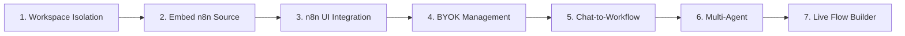

# Next Steps - Implementation Plan

**Last Updated:** 2026-02-17
**Related:** [`OPENCLAW_AUTOMATION_OS.md`](OPENCLAW_AUTOMATION_OS.md)

---

## Overview

This document outlines the actionable implementation plan for completing OpenClaw as a fully AI-powered Automation OS with n8n as the workflow engine.

---

## Priority Order



---

## Phase 1: Complete Workspace Isolation

**Priority:** CRITICAL
**Status:** IN PROGRESS
**Blocking:** All other phases

### Tasks

#### 1.1 Cron Jobs Workspace Filtering - COMPLETE

**File:** [`openclaw/src/gateway/server-methods/cron.ts`](../openclaw/src/gateway/server-methods/cron.ts)

- [x] Add `workspaceId` field to cron job type definition
- [x] Update `cron.list` to filter by `client.pmosWorkspaceId`
- [x] Update `cron.add` to set `workspaceId` from client
- [x] Update `cron.update` to check workspace ownership
- [x] Update `cron.remove` to check workspace ownership
- [x] `cron.run` and `cron.runs` check workspace ownership

#### 1.2 Sessions Workspace Filtering - COMPLETE

**File:** [`openclaw/src/gateway/server-methods/sessions.ts`](../openclaw/src/gateway/server-methods/sessions.ts)

- [x] Update `sessions.list` to filter by agent's workspace
- [x] Update `sessions.preview` to check agent ownership
- [x] Update `sessions.resolve/patch/reset/delete/compact` to check agent ownership

#### 1.3 Workspace-Scoped Configs

**Files:** [`openclaw/src/config/`](../openclaw/src/config/)

- [ ] Design workspace config file structure
- [ ] Implement config merge strategy (workspace overrides global)
- [ ] Update config loading to check workspace context
- [ ] Add workspace config API endpoints

**Proposed Structure:**
```
~/.openclaw/
  config.json                 # Global config
  workspaces/
    {workspaceId}/
      config.json             # Workspace overrides
```

#### 1.4 Migration Script - COMPLETE

**File:** [`openclaw/scripts/migrate-workspace-isolation.ts`](../openclaw/scripts/migrate-workspace-isolation.ts)

- [x] Auto-detect super_admin workspaceId from pmos-auth.json
- [x] Assign all existing agents to super_admin workspace (via main config)
- [x] Assign all existing cron jobs to super_admin workspace
- [x] Backup via config rotation (writeConfigFile keeps 5 backups)
- [x] Supports --dry-run and --workspace-id flags

#### 1.5 Testing - COMPLETE

**File:** [`openclaw/src/gateway/workspace-isolation.test.ts`](../openclaw/src/gateway/workspace-isolation.test.ts)

- [x] 31 cross-workspace isolation tests passing
- [x] Test User A cannot see User B's data
- [x] Test User A cannot modify User B's resources
- [x] Test super_admin can see all workspaces
- [x] Workspace isolation is symmetric (no leakage)

**Validation:**
```bash
corepack pnpm --dir openclaw exec vitest run src/gateway/workspace-isolation.test.ts
```

---

## Phase 2: Embed n8n Source Code

**Priority:** CRITICAL
**Status:** IN PROGRESS
**Depends on:** Phase 1

### Overview

Embed n8n source code directly in OpenClaw for unlimited customization. This replaces the separate n8n deployment model with a fully integrated approach.

### Tasks

#### 2.1 Clone n8n Source

- [ ] Clone n8n repository to `openclaw/vendor/n8n/`
- [ ] Pin to stable version (tagged release)
- [ ] Set up build process for n8n packages
- [ ] Verify n8n builds successfully

**Commands:**
```bash
# Clone n8n into vendor directory
cd openclaw
mkdir -p vendor
git clone --depth 1 --branch v1.50.0 https://github.com/n8n-io/n8n.git vendor/n8n

# Install dependencies
cd vendor/n8n
pnpm install

# Build n8n
pnpm build
```

#### 2.2 Custom Auth Integration - COMPLETE

**File:** [`openclaw/src/gateway/n8n-auth-bridge.ts`](../openclaw/src/gateway/n8n-auth-bridge.ts)

- [x] Auth bridge resolves OpenClaw session → n8n auth cookie/API key
- [x] Cached session management with 30-min TTL
- [x] Auto-creates n8n workspace users on first access
- [x] Integrated into pmos-ops-proxy for transparent auth injection
- [x] Fallback chain: cached cookie → server-side login → API key

#### 2.3 Workspace-Aware Triggers - COMPLETE

**File:** [`openclaw/src/gateway/n8n-workspace-triggers.ts`](../openclaw/src/gateway/n8n-workspace-triggers.ts)

- [x] Workflow → workspace registry with CRUD operations
- [x] Webhook workspace isolation enforcement
- [x] Execution context tagging with workspace metadata
- [x] Bulk hydration for startup registry loading

#### 2.4 Custom Nodes Integration

- [ ] Move Basecamp node to `openclaw/vendor/n8n/custom/nodes/`
- [ ] Create OpenClaw-specific nodes
- [ ] Register custom nodes with n8n
- [ ] Test custom nodes

#### 2.5 UI Customization

- [ ] Create `openclaw/vendor/n8n/custom/ui/` directory
- [ ] Customize n8n editor UI for OpenClaw branding
- [ ] Integrate n8n canvas into PMOS UI
- [ ] Remove n8n branding elements

### Benefits

| Benefit | Description |
|---------|-------------|
| Full Control | Modify any part of n8n for our needs |
| No API Limits | Direct function calls, no HTTP overhead |
| Custom Auth | Seamless integration with OpenClaw sessions |
| Workspace Isolation | Built into the core, not bolted on |
| UI Integration | n8n canvas as a native PMOS component |

---

## Phase 3: n8n UI Integration

**Priority:** HIGH
**Status:** IN PROGRESS
**Depends on:** Phase 1, Phase 2

### Tasks

#### 3.1 Embed n8n Canvas in OpenClaw UI - COMPLETE

**Files:**
- [`frontend/src/views/Flows.tsx`](../frontend/src/views/Flows.tsx) — React FlowBuilder with n8n iframe embed
- [`openclaw/src/gateway/pmos-ops-proxy.ts`](../openclaw/src/gateway/pmos-ops-proxy.ts) — Transparent n8n proxy with auth bridge

- [x] React FlowBuilder component with n8n iframe embed
- [x] n8n workflow list via `/api/ops/workflows` proxy
- [x] Workflow activate/deactivate controls
- [x] Auth bridge integration for seamless session passthrough
- [x] Fallback to MCP tool call for legacy Activepieces flows
- [x] Quick action templates (Basecamp Sync, Slack Alerts, Daily Report)

#### 3.2 Integrated Chat Sidebar

- [ ] Add chat panel to FlowBuilder view
- [ ] Enable chat to modify workflow nodes
- [ ] Show real-time updates from chat commands
- [ ] Handle approval workflows for destructive changes

#### 3.3 Seamless Navigation

- [ ] Remove need to open n8n separately
- [ ] All n8n features accessible from OpenClaw UI
- [ ] Consistent styling and branding
- [ ] Single sign-on between OpenClaw and n8n

---

## Phase 4: BYOK (Bring Your Own Keys) Management

**Priority:** HIGH
**Status:** COMPLETE
**Depends on:** Phase 1

### Tasks

#### 4.1 AI Provider Key Storage - COMPLETE

- [x] Design secure key storage schema (`openclaw/src/gateway/byok-store.ts`)
- [x] Implement encryption for stored keys (AES-256-GCM with server-side master key)
- [x] Add workspace-scoped key management (`~/.openclaw/workspaces/{id}/byok.json`)
- [x] Support multiple providers (OpenAI, Anthropic, Google, Azure, Custom)

**Implementation:**
- Encrypted storage: `openclaw/src/gateway/byok-store.ts`
- HTTP API: `openclaw/src/gateway/byok-http.ts`
- WS handlers: `pmos.byok.list`, `pmos.byok.set`, `pmos.byok.remove`, `pmos.byok.validate`
- Master key: `OPENCLAW_BYOK_SECRET` env var or auto-generated `~/.openclaw/byok.secret`

#### 4.2 BYOK Setup Wizard - COMPLETE

- [x] Key validation (test API call per provider)
- [x] Model selection UI (provider-specific model dropdowns)
- [ ] Cost estimation display (deferred to future)

#### 4.3 Key Management UI - COMPLETE

- [x] Settings page for AI keys (`frontend/src/views/Settings.tsx`)
- [x] Add/edit/remove keys
- [x] Key status indicators (valid/invalid with shield icons)
- [ ] Usage statistics per key (deferred to future)

---

## Phase 5: Chat-to-Workflow Creation

**Priority:** HIGH
**Status:** NOT STARTED
**Depends on:** Phase 2

### Tasks

#### 5.1 Natural Language Parser

- [ ] Implement intent recognition for workflow creation
- [ ] Map natural language to n8n node types
- [ ] Extract parameters from user description
- [ ] Handle ambiguous requests with clarifying questions

**Example Flow:**
```
User: "When a new todo is created in Basecamp, 
       create a matching issue in GitHub"

Parser:
  Trigger: Basecamp - New Todo
  Action: GitHub - Create Issue
  Mapping: todo.title -> issue.title, todo.description -> issue.body
```

#### 5.2 Workflow Generator

- [ ] Generate n8n workflow JSON from parsed intent
- [ ] Validate workflow structure
- [ ] Create workflow via n8n API
- [ ] Show preview before creation

#### 5.3 Chat-Driven Modifications

- [ ] Enable chat to modify existing workflows
- [ ] Add/remove nodes via chat
- [ ] Update node parameters via chat
- [ ] Activate/deactivate workflows via chat

---

## Phase 6: Multi-Agent Parallel Execution

**Priority:** MEDIUM
**Status:** NOT STARTED
**Depends on:** Phase 1

### Tasks

#### 6.1 Agent Runtime Enhancement

- [ ] Implement parallel agent execution
- [ ] Add agent orchestration layer
- [ ] Handle inter-agent communication
- [ ] Manage shared resources

**Architecture:**
```typescript
interface AgentOrchestrator {
  executeParallel(agents: Agent[], tasks: Task[]): Promise<Result[]>;
  broadcast(agents: Agent[], message: Message): void;
  coordinate(workflow: AgentWorkflow): Promise<void>;
}
```

#### 6.2 Agent Templates

- [ ] Create pre-configured agent blueprints
- [ ] Sales Agent template
- [ ] Support Agent template
- [ ] Dev Agent template
- [ ] PM Agent template

#### 6.3 Agent Dashboard

- [ ] Multi-agent status view
- [ ] Per-agent metrics
- [ ] Task queue visualization
- [ ] Agent health monitoring

---

## Phase 7: Live Flow Builder

**Priority:** MEDIUM
**Status:** NOT STARTED
**Depends on:** Phase 2, Phase 4

### Tasks

#### 7.1 Real-Time Canvas Updates

- [ ] WebSocket connection for live updates
- [ ] Node position sync
- [ ] Connection updates
- [ ] Execution visualization

#### 7.2 Flow Control Panel

- [ ] Activate/deactivate workflows
- [ ] Execution history
- [ ] Error handling UI
- [ ] Rollback controls

#### 7.3 Template Library

- [ ] Pre-built workflow templates
- [ ] One-click template deployment
- [ ] Template customization
- [ ] Community templates

---

## Deployment Checklist

### Before Each Deployment

1. **Run Tests**
   ```bash
   corepack pnpm --dir openclaw test
   corepack pnpm --dir openclaw/ui build
   ```

2. **Verify Services**
   - bcgpt.wickedlab.io/health
   - os.wickedlab.io
   - ops.wickedlab.io

3. **Deploy via Coolify**
   ```bash
   ssh -i C:\Users\rjnd\.ssh\bcgpt_hetzner deploy@46.225.102.175
   # Access Coolify and trigger deployment
   ```

4. **Post-Deployment Verification**
   - Login/signup flows
   - Workspace isolation
   - n8n connectivity

---

## Guardrails

1. **MCP Stability** - Do not change MCP contracts on bcgpt.wickedlab.io
2. **n8n Stability** - Do not break existing workflows on ops.wickedlab.io
3. **Additive Development** - PMOS work is additive to OpenClaw core
4. **Rollback Ready** - Every deployment must have immediate rollback path
5. **Smoke Tests** - Every phase must pass smoke checks before complete

---

## Session Start Protocol

Before starting work:

1. Read [`OPENCLAW_AUTOMATION_OS.md`](OPENCLAW_AUTOMATION_OS.md)
2. Read this document ([`NEXT_STEPS.md`](NEXT_STEPS.md))
3. Check current phase status
4. Run `git status --short`
5. Confirm guardrails

---

## Success Metrics

### Phase 1 Complete When:
- [ ] All data queries filter by workspace
- [ ] Cross-workspace isolation tests pass
- [ ] Super admin can manage all workspaces
- [ ] New signups get isolated workspace

### Phase 2 Complete When:
- [ ] n8n source pinned in `openclaw/vendor/n8n`
- [ ] Embedded n8n startup/build process is stable
- [ ] Custom auth/triggers wired for workspace context

### Phase 3 Complete When:
- [ ] n8n canvas embedded in OpenClaw UI
- [ ] Chat sidebar functional in flow builder
- [ ] No need to open n8n separately

### Phase 4 Complete When:
- [ ] Users can add their own AI keys
- [ ] Keys are validated and stored securely
- [ ] Multiple providers supported

### Phase 5 Complete When:
- [ ] Chat can create workflows end-to-end
- [ ] Chat can modify existing workflows
- [ ] Preview before creation works

### Phase 6 Complete When:
- [ ] Multiple agents run in parallel
- [ ] Agent templates available
- [ ] Agent dashboard shows all agents

### Phase 7 Complete When:
- [ ] Live flow builder with real-time updates
- [ ] Flow control panel functional
- [ ] Template library available
