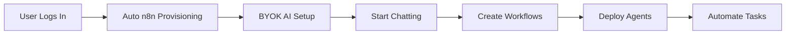
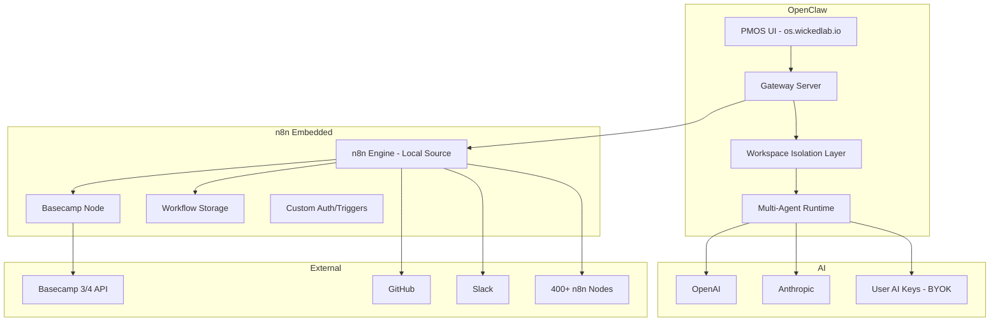

# OpenClaw Automation OS - Master Document

## Product Vision and User Journey

OpenClaw Automation OS is a fully AI-powered automation platform that combines workspace isolation, multi-agent capabilities, and chat-driven workflow creation to deliver a true automation operating system.

### User Journey
1. **Login & Workspace Setup**: Users log in to OpenClaw with automatic workspace isolation
2. **AI Configuration**: Users bring their own AI keys and configure their preferred AI services
3. **Chat-First Interaction**: Users start chatting immediately to create workflows and manage automation
4. **Multi-Agent Collaboration**: Users deploy multiple specialized agents for parallel task execution
5. **Live Flow Building**: Users activate/deactivate control flows and build workflows in real-time
6. **Seamless Integration**: Users interact with n8n through integrated chat without leaving the UI

---

## Product Vision

### User Journey



### Core Experience

1. **Login** - User signs in to OpenClaw with workspace isolation
2. **Auto n8n** - n8n instance automatically provisioned per workspace
3. **BYOK Setup** - User configures their own AI provider keys
4. **Chat Interface** - Start chatting to create workflows, manage tasks
5. **Agent Creation** - Create specialized agents for parallel task execution
6. **Flow Control** - Activate/deactivate workflows with live flow builder
7. **Integrated UI** - No need to configure chat separately in n8n UI

---

## Architecture Overview

### System Components



### Key Files

| Component | Location | Purpose |
|-----------|----------|---------|
| Gateway Server | [`openclaw/src/gateway/`](openclaw/src/gateway/) | Main server handling all requests |
| n8n Embed | [`openclaw/src/gateway/n8n-embed.ts`](openclaw/src/gateway/n8n-embed.ts) | Embedded n8n process management |
| Workspace Context | [`openclaw/src/gateway/workspace-context.ts`](openclaw/src/gateway/workspace-context.ts) | Multi-tenant isolation logic |
| Agent Handlers | [`openclaw/src/gateway/server-methods/agents.ts`](openclaw/src/gateway/server-methods/agents.ts) | Agent CRUD with workspace filtering |
| Basecamp Node | [`n8n-nodes-basecamp/`](n8n-nodes-basecamp/) | Custom n8n node for Basecamp |
| PMOS UI | [`openclaw/ui/`](openclaw/ui/) | User interface for OpenClaw |

---

## Current Implementation Status

### Completed Features

| Feature | Status | Details |
|---------|--------|---------|
| Auth System | COMPLETE | Signup, login, logout, session management |
| Role Bootstrap | COMPLETE | First user = super_admin, others = workspace_admin |
| Shell Restriction | COMPLETE | Non-super-admin blocked from shell access |
| n8n Integration | COMPLETE | n8n source vendored in `openclaw/vendor/n8n` and built (`n8n@1.76.1`) |
| n8n Embed Code | COMPLETE | [`n8n-embed.ts`](openclaw/src/gateway/n8n-embed.ts) ready |
| Basecamp n8n Node | BUILT | [`n8n-nodes-basecamp`](n8n-nodes-basecamp/) created |
| OpenClaw n8n Node | BUILT | `openclaw/vendor/n8n/custom/nodes/n8n-nodes-openclaw` created |
| Control UI Native Workflows | COMPLETE | Workflows tab embeds n8n editor directly (no redirect/new tab) |
| Workspace Context Helpers | COMPLETE | [`workspace-context.ts`](openclaw/src/gateway/workspace-context.ts) |
| Agent Workspace Filtering | COMPLETE | Agents scoped to workspace |
| Rate Limiting | COMPLETE | Per-workspace rate limits |
| Audit Logging | COMPLETE | Security audit trail |

### In Progress

| Feature | Status | Remaining Work |
|---------|--------|----------------|
| Workspace Isolation | IN PROGRESS | Core isolation + workspace configs complete; connector hardening and admin UX pending |
| Onboarding Wizard | PARTIAL | AI provider key setup step needed |
| n8n UI Integration | PARTIAL | Embedded navigation + SSO done, control UI now native in-dashboard; branding polish and full feature parity in progress |

### Not Started

| Feature | Priority | Description |
|---------|----------|-------------|
| Live Flow Builder | HIGH | Visual workflow editor with integrated chat |
| Multi-Agent Parallel Execution | HIGH | Run multiple agents concurrently |
| Chat-Driven Workflow Creation | HIGH | Create n8n workflows via chat |
| BYOK Usage Analytics | MEDIUM | Per-key usage statistics and cost visibility |
| Flow Activation Controls | MEDIUM | Start/stop/pause workflows from chat |
| Agent Templates | MEDIUM | Pre-configured agent blueprints |

---

## n8n Integration Details

### Why n8n Over Activepieces

| Criterion | Activepieces CE | n8n |
|-----------|-----------------|-----|
| Multi-tenancy | Enterprise only | DIY patterns available |
| API Quality | Good | Excellent |
| Self-hosting | Deployed | Mature |
| Visual Builder | Good | Best-in-class |
| Integrations | ~400 pieces | 400+ mature nodes |
| Licensing | MIT but multi-tenant paid | Fair-code, all features free |
| Cost | $0 or $$$ for enterprise | $0 |

**Decision:** Migrate to n8n for better multi-tenancy support and no licensing costs.

### n8n Deployment

- **Default Runtime:** Embedded in OpenClaw (`openclaw/vendor/n8n`)
- **Embed Support:** [`n8n-embed.ts`](openclaw/src/gateway/n8n-embed.ts) spawns n8n as child process
- **Legacy Remote Fallback:** Optional via connector/API key settings when explicitly enabled
- **Custom Nodes:** Basecamp node ready for deployment

### Basecamp n8n Node

Located at [`n8n-nodes-basecamp/`](n8n-nodes-basecamp/):

```
n8n-nodes-basecamp/
  credentials/
    BasecampApi.credentials.ts
  nodes/
    Basecamp/
      Basecamp.node.ts
      GenericFunctions.ts
  package.json
```

**Supported Resources:**
- Projects, Todos, Todo Lists
- Messages, Cards, Comments
- Documents, Files, People

---

## Workspace Isolation

### Architecture Decision

**Chosen Pattern:** Row-Level Tenancy
- Add `workspaceId` field to every entity
- Filter all queries by `client.pmosWorkspaceId`
- Industry standard used by Stripe, Slack, GitHub

### Implementation Status

| Layer | Status | Implementation |
|-------|--------|----------------|
| Agents | COMPLETE | [`agents.ts`](openclaw/src/gateway/server-methods/agents.ts) filters by workspace |
| Cron Jobs | COMPLETE | [`cron.ts`](openclaw/src/gateway/server-methods/cron.ts) filters and enforces ownership |
| Sessions | COMPLETE | [`sessions.ts`](openclaw/src/gateway/server-methods/sessions.ts) scoped by agent workspace ownership |
| Configs | COMPLETE | Workspace overrides + HTTP APIs (`openclaw/src/gateway/workspace-config.ts`, `openclaw/src/gateway/workspace-config-http.ts`) |
| Connectors | IN PROGRESS | Workspace-scoped connector APIs implemented; final cleanup/deprecation path ongoing |

### Workspace Context API

```typescript
// From workspace-context.ts
getWorkspaceId(client): string | undefined
requireWorkspaceId(client): string
isWorkspaceOwned(client, resourceWorkspaceId): boolean
requireWorkspaceOwnership(client, resourceWorkspaceId, resourceType): void
filterByWorkspace(items, client): T[]
addWorkspaceId(resource, client): T & { workspaceId?: string }
isSuperAdmin(client): boolean
```

---

## Multi-Agent Capabilities

### Vision

Users can create multiple specialized agents that run in parallel:

```
Workspace: Acme Corp
  - Sales Agent: Handles lead qualification
  - Support Agent: Manages customer tickets
  - Dev Agent: Monitors GitHub issues
  - PM Agent: Tracks project health
```

### Current State

- Agent CRUD with workspace isolation: COMPLETE
- Agent configuration: COMPLETE
- Agent identity/memory files: COMPLETE
- Parallel execution: NOT YET IMPLEMENTED

### Agent Configuration

Agents are defined in config with workspace scoping:

```json
{
  "agents": [
    {
      "id": "sales-agent",
      "name": "Sales Agent",
      "workspaceId": "ws-uuid-123",
      "workspace": "~/agents/sales-agent",
      "model": "claude-3-opus"
    }
  ]
}
```

---

## Chat-Driven Workflow Creation

### Vision

User chats naturally, workflows are created automatically:

```
User: "When a new todo is created in Basecamp, 
       create a matching issue in GitHub and 
       notify the team in Slack"

OpenClaw: "I'll create a workflow for this:
           1. Trigger: Basecamp - New Todo
           2. Action: GitHub - Create Issue
           3. Action: Slack - Send Message
           
           [Create Workflow] [Modify]"
```

### Implementation Path

1. Parse natural language intent
2. Map to n8n node types
3. Generate workflow JSON
4. Create via n8n API
5. Show in live flow builder
6. User can modify visually

---

## Live Flow Builder

### Vision

Integrated flow builder with chat sidebar:

```
+-------------------+-------------------+
|                   |                   |
|   Flow Canvas     |   Chat Sidebar    |
|   (n8n-style)     |   (AI Assistant)  |
|                   |                   |
|   [Trigger]       |   User: Create a  |
|      |            |   workflow...     |
|   [Action 1]      |                   |
|      |            |   AI: I've added  |
|   [Action 2]      |   the nodes...    |
|                   |                   |
+-------------------+-------------------+
```

### Key Features

- Visual node-based canvas
- Real-time updates from chat
- Integrated configuration panel
- No context switching between chat and builder

---

## Next Steps

See [`NEXT_STEPS.md`](NEXT_STEPS.md) for detailed implementation plan.

### Immediate Priorities

1. **Connector Hardening + Admin UX** - Finish workspace connector governance and super_admin workspace controls
2. **n8n UI Customization** - Add OpenClaw branding and remove remaining n8n-native UI seams
3. **Integrated Chat Sidebar** - Complete chat-driven edits in the flow builder
4. **Chat-to-Workflow Engine** - Implement parser + workflow JSON generation + preview flow
5. **Multi-Agent Parallel Execution** - Build orchestrator and agent dashboard

---

## Guardrails

1. **MCP Stability** - Do not change MCP contracts on bcgpt.wickedlab.io
2. **n8n Stability** - Do not break existing embedded n8n workflows and workspace isolation
3. **Additive Development** - PMOS work is additive to OpenClaw core
4. **Rollback Ready** - Every deployment must have immediate rollback path
5. **Smoke Tests** - Every phase must pass smoke checks before complete

---

## Related Documentation

- [`NEXT_STEPS.md`](NEXT_STEPS.md) - Actionable implementation plan
- [`N8N_INTEGRATION_GUIDE.md`](N8N_INTEGRATION_GUIDE.md) - n8n technical details
- [`COOLIFY_DEPLOY_NX_RUNBOOK.md`](COOLIFY_DEPLOY_NX_RUNBOOK.md) - Coolify + Nx deploy/runbook
- [`WORKSPACE_ISOLATION_STATUS.md`](WORKSPACE_ISOLATION_STATUS.md) - Multi-tenant status
- [`BASECAMP_NODE_SETUP.md`](BASECAMP_NODE_SETUP.md) - Custom n8n node guide

---

## Deployment URLs

| Service | URL | Purpose |
|---------|-----|---------|
| OpenClaw PMOS | https://os.wickedlab.io | Main product UI (includes embedded n8n) |
| OpenClaw n8n Editor | https://os.wickedlab.io/ops-ui/ | Embedded n8n editor route |
| BCGPT MCP | https://bcgpt.wickedlab.io | MCP server |

---

## n8n Embedded Architecture

**Vision:** n8n is NOT a separate deployment. It is fully embedded within OpenClaw with source code locally available for unlimited customization.

### Directory Structure

```
openclaw/
  vendor/
    n8n/                    # Full n8n source code (to be added)
      packages/
        cli/                # n8n CLI
        core/               # Core workflow engine
        nodes-base/         # Standard nodes
        workflow/           # Workflow types
      custom/               # Our customizations
        auth/               # Custom auth (OpenClaw session integration)
        triggers/           # Custom triggers (workspace-aware)
        ui/                 # Custom UI components
```

### Customization Capabilities

| Area | Customization |
|------|---------------|
| Auth | Replace n8n auth with OpenClaw session system |
| Triggers | Workspace-aware triggers that respect isolation |
| UI | Full control over n8n UI appearance and behavior |
| Nodes | Custom nodes for OpenClaw-specific functionality |
| API | Modify n8n API to work with OpenClaw gateway |

### Implementation Tasks

1. **Clone n8n source** to `openclaw/vendor/n8n/`
2. **Custom auth** - Replace n8n auth with OpenClaw sessions
3. **Workspace context** - Make all triggers/nodes workspace-aware
4. **UI customization** - Integrate n8n canvas into PMOS UI
5. **Custom nodes** - Add Basecamp node and OpenClaw-specific nodes

### Benefits

- **Full Control** - Modify any part of n8n for our needs
- **No API Limits** - Direct function calls, no HTTP overhead
- **Custom Auth** - Seamless integration with OpenClaw sessions
- **Workspace Isolation** - Built into the core, not bolted on
- **UI Integration** - n8n canvas as a native PMOS component
