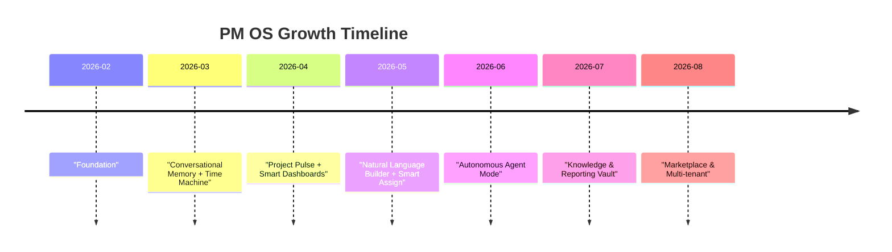
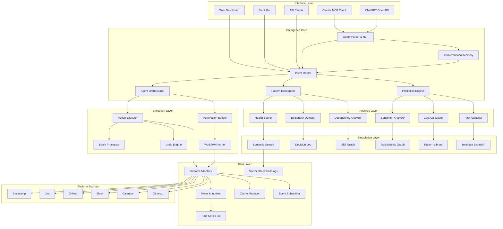
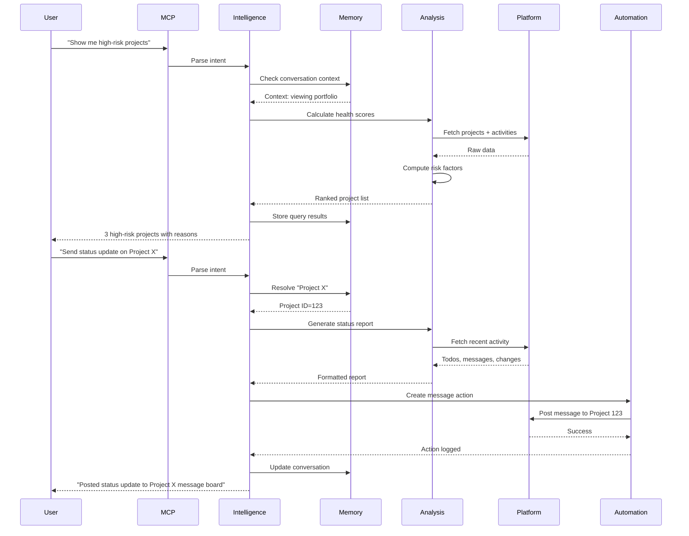
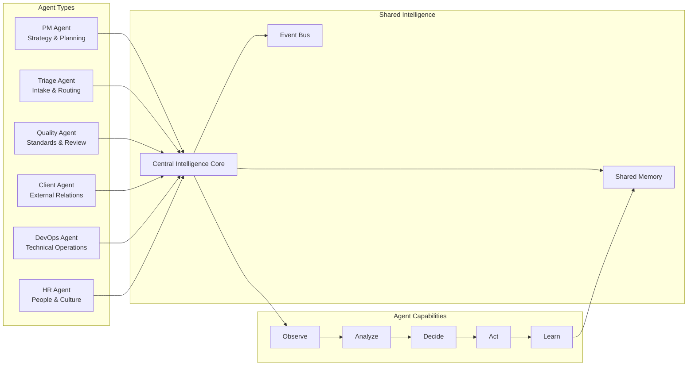
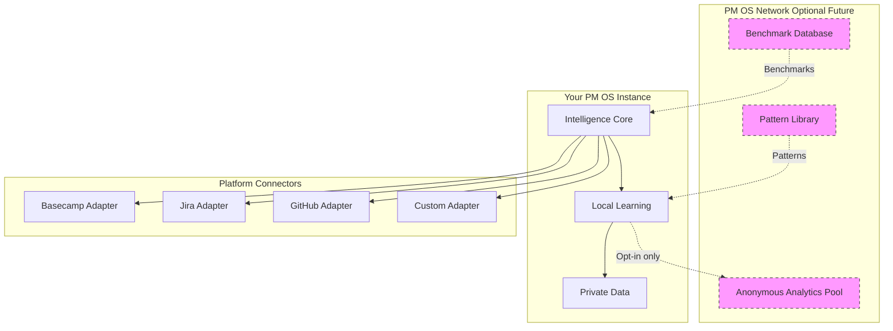
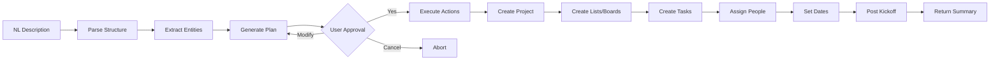

# BCGPT Project Management OS Vision

> Status note (2026-02-15): This document is the master PMOS vision/spec narrative.
> Canonical implementation status and build sequence are tracked in `docs/system/operations/summaries/CURRENT_STATE_AND_EXECUTION_PLAN.md`.

## Executive Summary
BCGPT is no longer just a Basecamp MCP server. It is the seed of the **world's first full Project Management Operating System (PM OS)** — a data layer that can plug into any platform, an intelligence engine that reasons, and an autonomy layer that acts. Basecamp + Activepieces + Claude/ChatGPT/Others are the **first tenant** of that OS. The goal is to document every insight, every idea, and every diagram so nothing is lost while we continue building.

## 1. Data Layer (Already Built)
- **291 MCP tools** (218 curated + 73 auto-generated) expose every Basecamp 3 endpoint, including todos, card tables, messages, documents, schedules, webhooks, recordings, questionnaires, templates, and raw API access.
- **Multi-user OAuth + API keys**, idempotency, circuit breaker, retries, and coverage metadata keep the data conductivity resilient.
- **Miner + indexer** crawls Basecamp and stores structured, searchable snapshots in SQLite/Postgres with background refresh intervals.
- **RequestContext** caches people/projects per request, preventing redundant API calls.
- **Large payload cache** chunks card tables with `get_cached_payload_chunk`/`export_cached_payload` for big responses.
- **Activepieces integration** lives alongside as a sibling monorepo; the Express server can proxy traffic (`ACTIVEPIECES_PROXY_ENABLED`) and both systems can eventually share automations.

## 2. Intelligence Layer (In Progress)
We now layer on AI-native reasoning:
1. **Project Pulse** (health scores, risk factors, velocity, dependencies).
2. **Bottleneck & Ghost Work Detection** (blocked but unstated items, context-switching, silent dependencies, meeting cost).
3. **Time Machine** (snapshot diff engine for „what changed since“ and activity summaries). 
4. **Conversational Memory** (contextual reference resolution, pronoun handling, chaining queries).
5. **Natural Language Project Builder** (describe a project in English, build all lists, cards, messages, assignments). 
6. **Agent Mode** (goal-driven autonomous assistant that checks status, makes decisions, posts updates). 
7. **Meeting Intelligence** (pre/post meeting briefs, cost warnings). 
8. **Multi-persona Responses** (PM, IC, Executive, Client modes). 
9. **Dependency Engine & Critical Path** (derived from todo semantics). 
10. **Knowledge Base** (semantic search, decision logs, FAQ generation). 
11. **Predictive Deadlines** (velocity + estimation modeling). 
12. **AI Delegation Engine** (load-aware assignment suggestions). 
13. **Retrospective & Failure Analysis** (automated postmortems). 
14. **Focus Mode** (daily briefing, what to work on, end-of-day summary). 
15. **Context Handoff / Onboarding** (knowledge capture when people join/leave). 
16. **Communication Optimizer** (unanswered questions, redundant threads, tone shifts, draft assistant). 
17. **Estimation Engine** (learns from true effort vs. estimated). 
18. **Template Evolution** (templates that learn from usage). 
19. **Semantic & Temporal Search** (embedding-powered textual search, time-based, person-scoped). 
20. **Cost & Budget Intelligence** (labor burn, forecasts, cost comparisons). 
21. **Autonomous Automation Builder** (Activepieces automation generation and control). 
22. **Undo/Rollback Safety Net** (operation logs with reversal commands). 
23. **Multi-agent Coordination** (PM agent, Standup agent, Quality agent, Client agent, Triage agent). 
24. **Smart Dashboards** (NLP dashboards, cross-project comparators). 
25. **Policy & Compliance Layer** (approval flows, policy enforcement, audit trail). 
26. **Voice of the Customer** (client sentiment tracking, client updates). 
27. **Project DNA Cloning** (learn from successful templates). 
28. **Knowledge Graph / Relationship Intelligence** (collaboration graph, relationship suggestions). 
29. **Workload Simulator** (what-if load/reschedule simulation). 
30. **Smart Search** (semantic search, QA, decision retrieval). 
31. **Natural Language Queries** (ask English questions across data indexed locally). 
32. **Reporting Engine** (weekly status, comparative, executive). 
33. **Predictive Notification Rules** (webhook-driven, event-based alerts). 
34. **Conversation Compression** (model-aware response shaping). 
35. **Command Recipes** (multi-step templates saved and executed by name). 
36. **Meeting Cost Calculator** (dollars/hours per meeting, recommended attendee list). 
37. **Project Autopsy** (why a project failed vs. succeeded). 
38. **AI-to-AI Communication** (agents posting actionable todos/messages to each other). 
39. **Budget Forecasting** (labor-based budgets, per-person weights). 
40. **Client-Facing Intelligence** (professional summaries, client hygiene). 

### Additional Game-Changing Ideas (41–60+)
41. **Smart Triage Queue** — Every incoming message/todo gets categorized, tagged, and ranked for urgency automatically. 
42. **Goal Alignment Matrix** — Visualizes how todos map to strategic goals and aggregates progress. 
43. **Auto-generate OKRs** — Identify emergent objectives from project activity and form OKR drafts. 
44. **Decision Impact Simulator** — Simulate consequences of decisions (e.g., reassign Sarah → what shifts?). 
45. **Internal Playbook Builder** — Auto-generate playbooks from recurring recipes + learnings. 
46. **AI-suggested Training Materials** — Detect skill gaps and recommend documentation or Activepieces exercises. 
47. **Mood & Engagement Tracker** — Sentiment + response latency as team mood proxies. 
48. **Cross-Platform Activity Graph** — Merge Basecamp, GitHub, Slack, Calendar data (future expansion). 
49. **Adaptive Contextual Summaries** — Summaries that shrink or expand based on prompt history. 
50. **Synthetic Personas for Testing** — Auto-generate fake users/todos to validate automations. 
51. **Team Rhythm Coach** — Notes when standups/buy-ins drift and nudges to refocus. 
52. **AI Catalog for Automations** — Discover, rate, and reuse automations built by other teams. 
53. **Live Action Plans** — Convert a plan into actionable steps assigned to people + due dates instantly. 
54. **Conflict Detector** — Identifies scheduling conflicts, duplicated work, or overlapping claims. 
55. **Regulatory Guardrails** — Compliance checks for industries (e.g., “Is client data being shared outside approved boards?”). 
56. **Natural Language Etiquette** — Ensures responses meet persona tone expectations (formal vs. casual). 
57. **Mission Control Interface** — Unified board that shows health, automations, alerts, and agent status. 
58. **Team Companion Widget** — A mini-UI or chat plugin that surfaces AI insights in context (Slack, Basecamp, email). 
59. **Automated Experimentation** — Run A/B experiments on workflows (e.g., daily standup vs. asynchronous updates) and report winners. 
60. **Project Coach** — Suggests next experiments when progress stalls (e.g., “Try pairing two new people on the bug list”).

## 3. Autonomy & Platform Layer
- **Natural Language Goals**: Users describe intentions; the PM OS orchestrates plan generation, automations, assignments, and updates.
- **Activepieces Bridge**: Once Basecamp data flows through the MCP server, the OS can translate intents into Activepieces automations, schedule triggers, and even deploy new flows programmatically.
- **Webhooks + Real-time**: Hook into Basecamp events to trigger intelligent rules (overdue items, new people, schedule changes). That completes the data layer with event awareness.
- **Undo/rollback + Audit**: Every autonomous action logs a reversal command, enabling one-phrase „undo“ while keeping compliance records.
- **Agent Ecosystem**: Build a catalog of agents (PM, Triage, Client, Quality) that collaborate by posting to campfires/todos and by calling MCP tools on each other.
- **Marketplace & Growth**: Eventually productize through multi-tenant SaaS, sharing templates, sharing automations, and inviting third parties to build intelligence modules on top of the core data.

## 4. Architecture Diagrams

### 4.1 PM OS Overview
```mermaid
digraph PMOS {
  rankdir=LR
  subgraph "Data Layer"
    BC(Basecamp API)
    AP(Activepieces Flows)
    MCP(BCGPT MCP Server)
    Miner(Miner + Indexer)
    Cache(Calculated Caches)
    DB(Database)
    BC --> MCP
    AP --> MCP
    MCP --> Miner
    Miner --> DB
    MCP --> Cache
  end
  subgraph "Intelligence Layer"
    Parser(Query Parser)
    Executor(Intelligent Executor)
    Enricher(Result Enricher)
    Agents(Agent Runbook)
    Parser --> Executor
    Executor --> Enricher
    Executor --> Agents
  end
  subgraph "Interface Layer"
    ChatGPT(OpenAPI)
    Claude(MCP Clients)
    UI(Team Dashboard)
    ChatGPT --> Parser
    Claude --> Parser
    UI --> Agents
  end
  Cache --> Intelligence
}
```

### 4.2 Phase Timeline


## 5. Implementation Waves
| Wave | Focus | Key Deliverables |
|-----|-------|------------------|
| 1 | Foundation | Conversational memory, snapshot diffs, operation logs |
| 2 | Intelligence | Project Pulse, natural language dashboards, focus mode |
| 3 | Construction | NL project builder, smart assign, predictive deadlines |
| 4 | Autonomy | Agent orchestration, proactive alerts, undo/rollback |
| 5 | Knowledge | Retrospectives, decision logs, semantic search |
| 6 | Compliance | Audit trail, policy engine, enterprise reporting |
| 7 | Platform | Automation marketplace, templates, multi-tenant SaaS |
| 8 | Expansion | Multi-platform bridges (GitHub, Slack, etc.), AI personas |

## 6. Documentation Mandate
Record every idea, diagram, and discovery so the PM OS intellect stays intact: use this doc as the **single source of truth for PMOS vision**, append new sections, and keep diagrams updated. Every feature in the catalog should have follow-up sub-docs (flowcharts, API contracts, UX sketches) ideally linked from here. Use the canonical tracker for live execution status.

## 7. Multi-Platform Vision: PM OS as Universal Layer

### 7.1 Platform-Agnostic Architecture (Powered by Activepieces)

**🎯 CRITICAL INSIGHT: We don't need to build MCP servers for every platform!**

Activepieces already has 200+ integrations built, maintained, and ready to use. PM OS becomes universal by orchestrating Activepieces flows, not by building dozens of MCP servers.

```
┌──────────────────────────────────────────────────────────────┐
│                    PM OS Intelligence Core                    │
│            (The Brain - Platform-Agnostic)                   │
├──────────────────────────────────────────────────────────────┤
│  • Conversational Memory    • Project Pulse                  │
│  • Predictive Analytics     • Agent Orchestration            │
│  • Natural Language Builder • Smart Assignment               │
│  • Knowledge Graph          • Autonomous Actions             │
│  • Cost Intelligence        • Compliance & Audit             │
└──────────────────────────────────────────────────────────────┘
              │                              │
              ▼                              ▼
┌───────────────────────┐     ┌──────────────────────────────────┐
│  Basecamp MCP Server  │     │  Activepieces (flow.wickedlab.io)│
│  (Deep Data Layer)    │     │  (Universal Execution Engine)    │
├───────────────────────┤     ├──────────────────────────────────┤
│ ✅ 291 tools          │     │ 📦 200+ PRE-BUILT PIECES:        │
│ ✅ Intelligent cache  │     │                                  │
│ ✅ Multi-user OAuth   │     │ ✅ Project Management:           │
│ ✅ Background miner   │     │    Basecamp, Jira, Asana,        │
└───────────────────────┘     │    Linear, Monday, ClickUp,      │
                              │    Trello, Notion, Todoist       │
                              │                                  │
                              │ ✅ Development:                  │
                              │    GitHub, GitLab, Bitbucket     │
                              │                                  │
                              │ ✅ Communication:                │
                              │    Slack, Discord, Teams, Email  │
                              │                                  │
                              │ ✅ Data & Docs:                  │
                              │    Google Sheets, Airtable,      │
                              │    Notion, Confluence            │
                              │                                  │
                              │ ✅ Calendar & Time:              │
                              │    Google Cal, Outlook, Calendly │
                              │                                  │
                              │ ✅ AI & ML:                      │
                              │    OpenAI, Anthropic, many more  │
                              │                                  │
                              │ ✅ + 170 more platforms!         │
                              │                                  │
                              │ NO NEW MCP SERVERS NEEDED! 🚀    │
                              └──────────────────────────────────┘
```

**This changes the entire development strategy:**
- **Before**: Build 20+ MCP servers (years of work)
- **After**: Build intelligence layer + orchestrate Activepieces (months of work)

### 7.2 Activepieces as Universal Platform Adapter

**Old thinking**: Build custom MCP server for each platform
**New thinking**: Use Activepieces pieces + intelligent orchestration

```typescript
// PM OS doesn't call platforms directly
// It generates and executes Activepieces flows

interface ActiveepiecesOrchestrator {
  // Generate flow from natural language
  generateFlow(intent: string): Promise<FlowDefinition>
  
  // Execute cross-platform actions
  async executeIntent(intent: string, context: any) {
    // Example: "Create GitHub issue when Basecamp todo is overdue"
    return {
      trigger: { piece: 'basecamp', event: 'todo_overdue' },
      actions: [
        { piece: 'github', action: 'create_issue', data: {...} },
        { piece: 'slack', action: 'send_message', data: {...} }
      ]
    }
  }
  
  // Intelligence-triggered workflows
  async onHealthScoreDrop(project: Project) {
    await this.triggerFlow('escalate-risk', {
      actions: [
        { piece: 'jira', action: 'create_ticket' },
        { piece: 'email', action: 'notify_stakeholders' },
        { piece: 'sheets', action: 'update_dashboard' }
      ]
    })
  }
}
```

**Current State:**
- ✅ Basecamp MCP Server: 291 tools, fully implemented (deep integration)
- ✅ Activepieces: 200+ pieces ready to use (free, maintained by community)
- 🔜 PM OS → Activepieces orchestration layer (Wave 1-2)
- 🔜 Natural language → flow generation (Wave 3)
- 🔜 Intelligence triggers → automated flows (Wave 4)

**No need to build:**
- ❌ Jira MCP Server → Use Activepieces Jira piece
- ❌ GitHub MCP Server → Use Activepieces GitHub piece  
- ❌ Slack MCP Server → Use Activepieces Slack piece
- ❌ 197+ more MCP servers → Use existing Activepieces pieces

### 7.3 Unified Data Model
The intelligence layer operates on a **platform-neutral** data model:

```yaml
# Universal PM Entities
Project:
  id: string
  name: string
  status: active|archived|completed
  health_score: number (0-100)
  people: Person[]
  metadata: platform-specific

Task:
  id: string
  title: string
  description: string
  status: todo|in_progress|blocked|done
  assignees: Person[]
  due_date: timestamp
  dependencies: Task[]
  effort_estimate: number
  actual_effort: number
  platform_type: todo|issue|ticket|card
  
Person:
  id: string
  name: string
  email: string
  capacity: number (0-100%)
  velocity: number (tasks/week)
  skills: string[]
  
Activity:
  timestamp: timestamp
  actor: Person
  action: created|updated|completed|commented|moved
  target: Task|Project|Document
  metadata: platform-specific
```

## 8. Breakthrough Ideas: The Next 40 (61-100)

### 8.1 Advanced Intelligence

**61. Skill Graph Mapping**
- Track what each person has worked on (frontend, backend, design, copywriting, etc.)
- Build a skills matrix across the team
- `recommend_assignee(task_description)` → Uses NLP to extract required skills, matches to people
- `skill_gap_analysis(project)` → "This project needs 40hrs of React work but your team has 10hrs capacity"

**62. Burnout Prediction**
- Monitor workload intensity, working hours patterns, completion velocity decline
- `burnout_risk(person?)` → Risk score with contributing factors
- Proactive intervention: "Mike has been at 120% capacity for 3 weeks, completion rate dropped 40%, and last 5 messages were terse. Consider redistributing load."

**63. Deadline Negotiation Assistant**
- When a deadline is at risk: `suggest_mitigation(project, deadline)` →
  - Option A: Add 2 people, hit deadline, cost +$12K
  - Option B: Extend by 1 week, no cost increase
  - Option C: Cut features X, Y (lowest priority), hit deadline
- AI runs the simulation and presents trade-offs

**64. Pattern Recognition Across Projects**
- "Your design review phase always takes 2.3x longer than estimated"
- "Projects that start with incomplete requirements have 4x the scope creep"
- "When Person X and Person Y work together, velocity increases 35%"
- `learn_patterns()` → Discovers correlations automatically

**65. Risk Cascade Analysis**
- One task is delayed → What else does that block?
- One person goes on leave → Which projects are exposed?
- One dependency fails → Impact radius?
- `cascade_impact(event)` → Shows ripple effects across portfolio

**66. AI-Powered Sprint Planning**
- `plan_sprint(team, capacity, backlog)` → 
  - Sorts backlog by value + effort + dependencies
  - Assigns based on skills + availability
  - Balances load
  - Detects impossible commitments
  - Suggests what to defer

**67. Meeting Effectiveness Scoring**
- After each meeting (schedule entry), analyze:
  - Did todos get created/completed after?
  - Did decisions get made? (NLP on follow-up messages)
  - Was the agenda followed?
- `meeting_score(schedule_entry_id)` → Effectiveness rating
- Over time: "Your Friday standups have 23% lower effectiveness than Monday standups"

**68. Decision Debt Tracker**
- Some decisions are deferred repeatedly ("we'll decide later")
- Track unresolved decisions and their age
- `decision_debt()` → List of pending decisions, how long they've been waiting, what they're blocking

**69. Context Switch Tax Calculator**
- Track when people jump between projects
- Calculate productivity cost (research shows 20-30 min lost per switch)
- `context_switches(person, period)` → Visualize switching patterns and lost time
- Recommend consolidation: "If Mike worked on just 2 projects instead of 5 this week, he'd gain 8 hours"

**70. Auto-Tagging & Classification**
- Every task, message, document gets auto-tagged by NLP
  - Type: bug, feature, chore, research
  - Domain: frontend, backend, design, marketing
  - Priority: critical, high, medium, low
  - Sentiment: urgent, blocked, confused, confident
- Enables filtering, routing, and aggregate analysis

### 8.2 Collaboration & Communication

**71. Communication Equity Monitor**
- Who speaks most in messages/comments? Who's silent?
- Detect if certain voices dominate or are drowned out
- `communication_balance(project)` → Shows distribution, flags imbalances

**72. Question-Response Time Heatmap**
- When someone asks a question (message/comment with "?"), track time to response
- By person, by project, by time of day
- Helps identify communication bottlenecks

**73. Cross-Project Knowledge Transfer**
- When someone solves a problem in Project A, surface that solution when similar problem appears in Project B
- `find_similar_solutions(description)` → Searches across all project discussions

**74. Automated Meeting Notes**
- When a schedule entry ends, generate a summary:
  - Attendees
  - Topics mentioned (from pre-meeting context)
  - Decisions (from post-meeting messages)
  - Action items (new todos created)
- Post as a message automatically

**75. Smart @Mentions**
- When writing a message, AI suggests who to @mention based on:
  - Who's worked on related tasks
  - Who has expertise (skill graph)
  - Who's been active in the discussion
  - Who's a stakeholder but hasn't been engaged

**76. Conflict Resolution Assistant**
- Detect when two people repeatedly disagree in comments
- Detect when decisions get reopened after being "settled"
- `detect_conflicts(project)` → Shows contentious topics, suggests mediation

**77. Onboarding Velocity Tracking**
- When new person joins, track time to first completed task
- Track how quickly they ramp to team average velocity
- Compare across team members: "New designers take 2.3 weeks to ramp, engineers take 4.1 weeks"

**78. "Who Knows About X?" Search**
- Semantic search across all activity: who has commented on, completed tasks about, or messaged about topic X
- `find_expert("GraphQL migration")` → Ranked by involvement + recency

**79. Async Communication Optimizer**
- Detect when timezone differences cause delays
- Suggest handoff patterns: "Person A (US) should finish their part by 5pm so Person B (EU) can start at 9am"
- `timezone_handoff_plan(project)` → Optimal work batching for distributed teams

**80. AI Scribe for Decisions**
- Runs continuously, watching messages/comments for decision keywords
- Extracts structured decisions: what was decided, who decided, when, alternatives considered
- `decision_log(project)` → Chronological decision history with rationale

### 8.3 Automation & Workflows

**81. Natural Language Workflow Builder**
- "When a task moves to Done, check if all subtasks are complete. If yes, post celebration message. If no, create a followup task."
- Translates to Activepieces flow, deploys automatically

**82. Conditional Automation Chains**
- "If task X is not started within 3 days of creation, escalate to manager"
- "If a task tagged 'security' is created, automatically assign to security team and add to Security Review board"

**83. Workflow Templates Library**
- Pre-built workflows:
  - New hire onboarding sequence
  - Sprint close-out checklist
  - Client approval workflow
  - Code review + deploy pipeline
- `install_workflow("new-hire-onboarding")` → One command, fully automated

**84. Event-Driven Intelligence**
- Webhooks feed into intelligence engine
- When task completed → Check if it unblocked anything → Notify waiting people
- When person added → Auto-create onboarding todos
- When deadline approaches with no activity → Alert and suggest reassignment

**85. Scheduled Intelligence Reports**
- `schedule_intelligence("monday 9am", "weekly-status-all-projects")` →
  - Every Monday, AI generates status report
  - Posts to designated message board
  - Includes pulse scores, risks, wins, blockers

**86. A/B Test Workflows**
- Run two teams/projects with different workflows
- Measure velocity, quality, satisfaction
- `ab_test_workflow("daily standup", "async updates", 4 weeks)` → Declares winner with statistical confidence

**87. Self-Healing Automations**
- Automation fails (API error, missing data) → Intelligence engine interprets error → Suggests fix or implements workaround
- `auto_heal: true` → Automations adapt to changing conditions

**88. Workflow Suggestions from Activity**
- "You manually update the status message every Friday. Want me to automate that?"
- "You've created the same 12 todos in 4 projects. Save as a template?"
- `suggest_automations()` → Discovers repetitive patterns

**89. Parallel Execution Optimizer**
- Task dependency graph → Identify parallelizable work
- `optimize_schedule(project)` → Reorders tasks, suggests parallel assignments to minimize total duration

**90. Rollback Workflows**
- "Undo the last automation run"
- "Revert project to state from 2 days ago"
- `time_travel(project, timestamp)` → Restores state (creates compensating actions, doesn't delete history)

### 8.4 Advanced Analytics & Insights

**91. Portfolio Health Dashboard**
- Aggregate view across all projects
- Health distribution, resource utilization, risk concentration
- Budget vs. actual across portfolio
- Bottleneck people (overallocated across projects)

**92. Predictive Resource Planning**
- Based on historical data + roadmap
- `forecast_needs(6 months)` → "You'll need 2 more designers in Q3 based on current project pipeline"

**93. Technical Debt Tracker**
- Tag tasks as "tech debt"
- Track ratio of feature work vs. debt work
- `debt_analysis()` → Shows accumulation rate, interest (velocity impact), recommended paydown schedule

**94. Velocity Trends & Anomaly Detection**
- Track team/person velocity over time
- Detect anomalies: sudden drops, spikes, plateaus
- Alert: "Team velocity dropped 40% this week. Probable causes: 3 people on vacation, 2 new joiners ramping."

**95. Value Flow Metrics**
- Cycle time (idea → done), lead time (committed → done), throughput
- Identify bottleneck stages
- `flow_metrics(project)` → Full value stream analysis

**96. Quality Metrics**
- Bug rate (bugs created / features completed)
- Rework rate (tasks reopened after completion)
- Defect escape rate (client-found bugs)
- Track by person, project, time period

**97. Cost Per Feature**
- Track time spent per feature (via task completion tracking)
- Multiply by person's rate
- `cost_breakdown(project)` → Shows which features were expensive vs. cheap
- Learn: "Feature X cost 3x the estimate because design took 5 iterations"

**98. Comparative Benchmarking**
- Compare your team's metrics to:
  - Your own historical data
  - Industry benchmarks (if available via PM OS network)
  - Similar-sized teams
- "Your team completes 12 tasks/week. Similar teams: 18 tasks/week. Gap analysis..."

**99. Sentiment Trending**
- Track sentiment in messages/comments over time
- Project sentiment score: -1 (negative) to +1 (positive)
- Alert when sentiment drops sharply: "Project sentiment dropped from +0.6 to +0.1 this week"

**100. Innovation Accounting**
- Separate tracking for exploratory/experimental work
- Track what % of time is spent on innovation vs. execution
- `innovation_ratio()` → Trends over time
- Helps balance "build new stuff" vs. "maintain existing stuff"

## 9. Detailed System Architecture

### 9.1 Core Intelligence Engine



### 9.2 Data Flow: From Query to Action



### 9.3 Agent Architecture



**Agent Collaboration Example:**
1. **Triage Agent** observes new task created with "urgent" tag
2. Notifies **PM Agent** of high-priority intake
3. **PM Agent** checks project capacity, decides assignment
4. **Quality Agent** checks if task has acceptance criteria (if not, adds template)
5. **DevOps Agent** checks if task needs infrastructure (tags appropriately)
6. **PM Agent** creates assignment, posts to project campfire
7. All agents log decisions to shared memory

### 9.4 Multi-Platform Intelligence Sharing



**Privacy-First Design:**
- All intelligence runs locally on your instance
- No data leaves your environment unless you explicitly opt in
- Benchmarking uses anonymous, aggregated metrics only
- Pattern sharing is opt-in and sanitized

## 10. Implementation Blueprint

### 10.1 Wave 1: Foundation (Weeks 1-2)
**Goal:** Enable stateful, context-aware interactions

**Deliverables:**
- [ ] Conversational memory system (`session_memory` table)
- [ ] Entity resolution (pronouns, "that project", "those tasks")
- [ ] Time machine: snapshot diffs (`snapshots` table + diff engine)
- [ ] Operation log with undo commands (`operation_log` table)

**Database Schema:**
```sql
CREATE TABLE session_memory (
  id SERIAL PRIMARY KEY,
  session_id TEXT NOT NULL,
  user_key TEXT NOT NULL,
  entity_type TEXT, -- 'project', 'person', 'task', etc.
  entity_id TEXT,
  entity_name TEXT,
  context JSONB, -- arbitrary context
  created_at TIMESTAMP DEFAULT NOW(),
  expires_at TIMESTAMP
);

CREATE TABLE snapshots (
  id SERIAL PRIMARY KEY,
  user_key TEXT NOT NULL,
  entity_type TEXT, -- 'project', 'task', 'person'
  entity_id TEXT,
  snapshot JSONB, -- full state
  created_at TIMESTAMP DEFAULT NOW()
);

CREATE TABLE operation_log (
  id SERIAL PRIMARY KEY,
  user_key TEXT NOT NULL,
  session_id TEXT,
  operation TEXT, -- 'create_task', 'assign', 'move_card', etc.
  target JSONB, -- what was operated on
  undo_operation TEXT, -- reverse operation type
  undo_args JSONB, -- args to pass to undo
  created_at TIMESTAMP DEFAULT NOW()
);
```

**API Extensions:**
```javascript
// New MCP tools
- resolve_reference(ref) // "that project" → project_id
- what_changed_since(entity, timestamp)
- who_did_what(person, since, until)
- undo_last(count)
- undo_operation(operation_id)
```

### 10.2 Wave 2: Intelligence (Weeks 3-4)
**Goal:** Make PM OS visibly smart

**Deliverables:**
- [ ] Project Pulse (health scoring algorithm)
- [ ] Focus Mode (`my_day`, `what_should_i_work_on`, `end_of_day`)
- [ ] Natural language query engine
- [ ] Smart dashboard generator

**Health Score Algorithm:**
```javascript
function calculateProjectHealth(project, activities, tasks) {
  const scores = {
    velocity: calculateVelocityScore(activities), // 0-25
    risk: calculateRiskScore(tasks), // 0-25
    communication: calculateCommScore(activities), // 0-25
    balance: calculateBalanceScore(tasks), // 0-25
  };
  
  const total = Object.values(scores).reduce((a, b) => a + b, 0);
  const grade = total >= 90 ? 'A' : total >= 80 ? 'B' : 
                total >= 70 ? 'C' : total >= 60 ? 'D' : 'F';
  
  return {
    score: total,
    grade,
    breakdown: scores,
    risks: identifyRisks(tasks, activities),
    recommendations: generateRecommendations(scores)
  };
}
```

**New MCP Tools:**
```javascript
- get_project_pulse(project_id)
- my_day() // personalized daily brief
- what_should_i_work_on() // prioritized task list
- end_of_day() // completion summary
- nl_query(question) // natural language over indexed data
- generate_dashboard(type) // portfolio, project, person
```

### 10.3 Wave 3: Construction (Weeks 5-6)
**Goal:** Build complex structures with natural language

**Deliverables:**
- [ ] Natural language project builder
- [ ] Smart assignment engine
- [ ] Predictive deadlines
- [ ] Recipe system

**NL Project Builder Flow:**


**New MCP Tools:**
```javascript
- build_project(description) // NL → full project structure
- smart_assign(tasks[], options) // intelligent assignment
- predict_completion(task_id) // ML-based prediction
- save_recipe(name, actions[]) // save multi-step workflow
- run_recipe(name, params) // execute saved recipe
```

### 10.4 Wave 4: Autonomy (Weeks 7-9)
**Goal:** AI that acts on goals, not just commands

**Deliverables:**
- [ ] Agent orchestration framework
- [ ] Proactive notification system
- [ ] Webhook event bridge
- [ ] Goal-based agent mode

**Agent Framework:**
```javascript
class Agent {
  constructor(role, goals, capabilities) {
    this.role = role; // 'pm', 'triage', 'quality', etc.
    this.goals = goals; // ['keep projects on track', 'ensure quality']
    this.capabilities = capabilities; // what tools it can call
    this.memory = new AgentMemory();
  }
  
  async observe() {
    // Check for events, changes, patterns
    const events = await this.subscribeToEvents();
    return events.filter(e => this.isRelevant(e));
  }
  
  async analyze(events) {
    // Reason about what's happening
    return await this.intelligenceCore.analyze(events, this.goals);
  }
  
  async decide(analysis) {
    // Choose actions based on goals
    return await this.planActions(analysis, this.capabilities);
  }
  
  async act(actions) {
    // Execute through MCP tools
    const results = [];
    for (const action of actions) {
      const result = await this.executeTool(action);
      results.push(result);
      await this.logAction(action, result);
    }
    return results;
  }
  
  async learn(actions, results) {
    // Update memory with outcomes
    await this.memory.store(actions, results);
  }
}
```

**New MCP Tools:**
```javascript
- set_agent_goal(agent_role, goal)
- list_agent_actions(agent_role, since)
- approve_agent_action(action_id)
- pause_agent(agent_role)
- resume_agent(agent_role)
- agent_status() // what are agents doing
```

### 10.5 Wave 5: Knowledge (Weeks 10-12)
**Goal:** Never forget, always learn

**Deliverables:**
- [ ] Semantic search with embeddings
- [ ] Decision log extraction
- [ ] Retrospective generator
- [ ] FAQ builder

**Semantic Search Implementation:**
```javascript
// Use OpenAI embeddings or local model
async function semanticSearch(query, entities) {
  // 1. Generate query embedding
  const queryEmbed = await generateEmbedding(query);
  
  // 2. Fetch entity embeddings from vector DB
  const candidates = await vectorDB.similaritySearch(queryEmbed, {
    limit: 100,
    threshold: 0.7
  });
  
  // 3. Rerank with keyword boost
  const results = candidates.map(c => ({
    ...c,
    score: c.similarity * 0.7 + keywordMatch(query, c.text) * 0.3
  }));
  
  // 4. Return ranked with context
  return results.sort((a, b) => b.score - a.score).slice(0, 20);
}
```

**New MCP Tools:**
```javascript
- semantic_search(query, scope) // embedding-powered search
- extract_decisions(project, since) // NLP decision extraction
- generate_retrospective(project, period)
- generate_faq(project)
- find_similar_problems(description) // cross-project knowledge
```

### 10.6 Wave 6: Enterprise (Weeks 13-15)
**Goal:** Compliance, governance, reporting

**Deliverables:**
- [ ] Full audit trail
- [ ] Policy enforcement engine
- [ ] Approval workflow system
- [ ] Enterprise reporting suite

**New MCP Tools:**
```javascript
- audit_trail(filters)
- set_policy(policy_definition)
- list_policies()
- require_approval(action_type, approver)
- generate_report(type, filters)
- schedule_report(cadence, type, distribution)
```

### 10.7 Wave 7: Platform (Weeks 16-20)
**Goal:** Ecosystem and marketplace

**Deliverables:**
- [ ] Multi-tenant architecture
- [ ] Template marketplace
- [ ] Automation library
- [ ] Plugin system

**New MCP Tools:**
```javascript
- publish_template(template)
- browse_marketplace(category)
- install_template(template_id)
- share_automation(automation)
- install_plugin(plugin_id)
```

## 11. Success Metrics

### 11.1 User Experience Metrics
- **Time to value**: Minutes from "I need X" to "I have X"
- **Query success rate**: % of NL queries that return useful results
- **Agent acceptance rate**: % of autonomous agent actions approved by users
- **Undo frequency**: How often users need to undo (lower is better, shows confidence)

### 11.2 Intelligence Metrics
- **Prediction accuracy**: How often deadline/completion predictions are within 20%
- **Assignment match quality**: % of smart assignments that aren't changed
- **Health score correlation**: Do pulse scores correlate with actual outcomes
- **Pattern discovery rate**: New patterns discovered per month

### 11.3 Platform Metrics
- **Platforms supported**: Number of platform adapters
- **Cross-platform queries**: % of queries spanning multiple platforms
- **Marketplace adoption**: Downloads/installs of shared templates/automations
- **Community contribution**: User-contributed patterns/recipes

### 11.4 Business Impact Metrics
- **Project success rate**: % hitting deadlines/budgets (pre vs post PM OS)
- **Team productivity**: Velocity increase (pre vs post)
- **Burnout reduction**: Overallocation incidents (pre vs post)
- **Cost savings**: Reduced waste from better planning
- **Customer satisfaction**: NPS or similar (for client-facing projects)

## 12. Technical Considerations

### 12.1 Scalability
- **Horizontal scaling**: Intelligence core should be stateless, scale behind load balancer
- **Database sharding**: Partition by user_key for multi-tenant
- **Cache hierarchy**: In-memory (L1) → Redis (L2) → Database (L3)
- **Async processing**: Heavy analysis runs in background jobs (Bull/BullMQ)

### 12.2 Security
- **Data isolation**: Strict tenant separation in multi-tenant mode
- **Encryption**: At rest (database) and in transit (TLS)
- **Audit logging**: All intelligence decisions logged with reasoning
- **RBAC**: Role-based access control for agent permissions

### 12.3 AI/ML Infrastructure
- **Model choices**:
  - NLP: GPT-4/Claude for complex reasoning
  - Embeddings: text-embedding-3 or local model
  - Classification: Fine-tuned BERT for tagging
  - Prediction: XGBoost/LightGBM for deadline/velocity
- **Training pipeline**: Continuous learning from operation logs
- **A/B testing**: Compare model versions on prediction accuracy

### 12.4 Monitoring & Observability
- **Intelligence telemetry**: Track every intelligence operation (latency, accuracy, cost)
- **Agent dashboards**: Real-time view of what agents are doing
- **Error tracking**: Sentry/similar for intelligence failures
- **Cost monitoring**: Track AI API usage and costs per tenant

## 13. Next Steps
1. **Immediate:** Create `docs/vision/` folder structure with per-feature specs
2. **Week 1:** Implement conversational memory + time machine (Wave 1 foundation)
3. **Week 2:** Build project pulse algorithm and test on real Basecamp data
4. **Ongoing:** Document every pattern, decision, and learning in this living doc
5. **Community:** Consider open-sourcing the intelligence layer (keep adapters pluggable)

---

**This is not a tool. This is an operating system for the future of work.**
